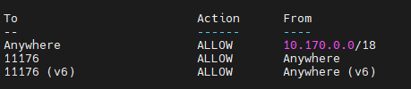
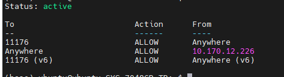

# dhclient

连接有线网络 

[Linux命令大全(手册)](https://www.linuxcool.com/)
[dhclient命令 – 动态获取或释放IP地址](https://www.linuxcool.com/dhclient)


dhclient命令来自于英文词组“DHCP client”的缩写，其功能是用于动态获取或释放IP地址。使用dhclient命令前需要将网卡模式设置成DHCP自动获取，否则静态模式的网卡是不会主动向服务器获取如IP地址等网卡信息的。

语法格式：dhclient 参数 [网卡]

sudo dhclient eth0
 
dmesg | grep eth


[linux 路由表设置 之 route 指令详解](https://www.cnblogs.com/AdamChen/p/12431199.html)

ubuntu 系统默认已安装ufw.


# ufw
1.安装
`sudo apt-get install ufw`

2.启用

```
sudo ufw enable
sudo ufw default deny
```

运行以上两条命令后，开启了防火墙，并在系统启动时自动开启。关闭所有外部对本机的访问，但本机访问外部正常。

3.开启/禁用
`
[sudo ufw allow|deny [service]

打开或关闭某个端口，例如：

```
sudo ufw allow smtp　允许所有的外部IP访问本机的25/tcp (smtp)端口
sudo ufw allow 22/tcp 允许所有的外部IP访问本机的22/tcp (ssh)端口
sudo ufw allow 53 允许外部访问53端口(tcp/udp)
sudo ufw allow from 192.168.1.100 允许此IP访问所有的本机端口
sudo ufw allow proto udp 192.168.0.1 port 53 to 192.168.0.2 port 53
sudo ufw deny smtp 禁止外部访问smtp服务
sudo ufw delete allow smtp 删除上面建立的某条规则
```

4.查看防火墙状态:`sudo ufw status`
一般用户，只需如下设置：

```
sudo apt-get install ufw
sudo ufw enable
sudo ufw default deny
```

设置多个端口
```
ListenAddress 0.0.0.0:11176
ListenAddress 0.0.0.0:22
ListenAddress 10.211.55.40:22  暂时没用
```
此时22 和11176 都可被内网访问
sudo ufw allow from 10.170.0.0/18
只有西电有线ip段可以被访问
（可以添加西电无线ip段子网 sudo ufw allow from 10.175.0.0/18）

此时添加
sudo ufw allow 11176 使得 所有连接11176的也可以
最终 0.0.0.0：11176都是可以的
同时内网 10.170.0.0:22也是可以的


如下图ufw status

\
但是内网也是危险的
sudo ufw  delete allow  from 10.170.12.226/16\
sudo ufw  allow  from 10.170.12.226 仅仅本机22 11176都可以连接其他必须11176\



[在 Ubuntu 中用 UFW 配置防火墙](https://linux.cn/article-8087-1.html)

