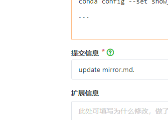

# apt
sudo gedit /etc/apt/sources.list
# 一、系统换源

```
打开sources文件
sudo gedit /etc/apt/sources.list
1
将下列清华源地址复制到改文件中，保存后退出
# 清华源
deb https://mirrors.tuna.tsinghua.edu.cn/ubuntu/ bionic main restricted universe multiverse
deb-src https://mirrors.tuna.tsinghua.edu.cn/ubuntu/ bionic main restricted universe multiverse
deb https://mirrors.tuna.tsinghua.edu.cn/ubuntu/ bionic-updates main restricted universe multiverse
deb-src https://mirrors.tuna.tsinghua.edu.cn/ubuntu/ bionic-updates main restricted universe multiverse
deb https://mirrors.tuna.tsinghua.edu.cn/ubuntu/ bionic-backports main restricted universe multiverse
deb-src https://mirrors.tuna.tsinghua.edu.cn/ubuntu/ bionic-backports main restricted universe multiverse
deb https://mirrors.tuna.tsinghua.edu.cn/ubuntu/ bionic-security main restricted universe multiverse
deb-src https://mirrors.tuna.tsinghua.edu.cn/ubuntu/ bionic-security main restricted universe multiverse
deb https://mirrors.tuna.tsinghua.edu.cn/ubuntu/ bionic-proposed main restricted universe multiverse
deb-src https://mirrors.tuna.tsinghua.edu.cn/ubuntu/ bionic-proposed main restricted universe multiverse

更新源
sudo apt-get update
```


# 二、pip换源

## pip 命令

```
pip config set global.index-url https://pypi.douban.com/simple/
/home/ubuntu/.config/pip/pip.conf

[global]
timeout = 6000
index-url = https://pypi.douban.com/simple/
[install] 可有可無
trusted-host=mirrors.aliyun.com

```

```
2.1 pip临时换源
pip install ***   -i https://pypi.tuna.tsinghua.edu.cn/simple
2.2 pip永久换源
vim使用命令

i 插入模式
Esc 退出插入模式
：wq或者 ：wq! 保存并退出

cd ~                    				  # 进入家目录 
mkdir .pip         				          # 新建.pip隐藏文件夹
cd .pip                				      # 进入.pip文件夹
touch pip.conf    			   	          # 新建pip.conf文件
vim pip.conf           				      # 用vim编辑pip.conf文件 

添加内容：

[global]                                                                    
index-url = http://pypi.tuna.tsinghua.edu.cn/simple/
trusted-host = pypi.tuna.tsinghua.edu.cn

2.3 pip其余国内源地址
https://pypi.douban.com/  ————    豆瓣 
 
https://mirrors.aliyun.com/pypi/simple/ ———— 阿里云
 
https://pypi.tuna.tsinghua.edu.cn/simple/ ————清华大学

https://pypi.hustunique.com/ ————华中理工大学 
 
https://pypi.mirrors.ustc.edu.cn/ ————中国科学技术大学 
```


# 三、conda换源

```
conda更换清华源

conda config --add channels https://mirrors.tuna.tsinghua.edu.cn/anaconda/pkgs/free/
conda config --add channels https://mirrors.tuna.tsinghua.edu.cn/anaconda/pkgs/main
conda config --add channels https://mirrors.tuna.tsinghua.edu.cn/anaconda/pkgs/r
conda config --add channels https://mirrors.tuna.tsinghua.edu.cn/anaconda/pkgs/msys2
conda config --add channels https://mirrors.tuna.tsinghua.edu.cn/anaconda/cloud/conda-forge
conda config --add channels https://mirrors.tuna.tsinghua.edu.cn/anaconda/cloud/msys2 
conda config --add channels https://mirrors.tuna.tsinghua.edu.cn/anaconda/cloud/bioconda
conda config --add channels https://mirrors.tuna.tsinghua.edu.cn/anaconda/cloud/menpo
conda config --add channels https://mirrors.tuna.tsinghua.edu.cn/anaconda/cloud/pytorch
conda config --add channels https://mirrors.tuna.tsinghua.edu.cn/anaconda/cloud/simpleitk
conda config --set show_channel_urls yes

```
