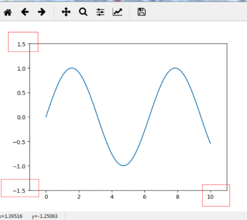
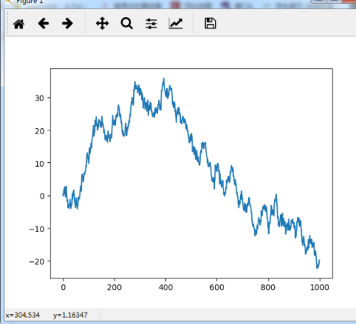

## 一、坐标轴上下限
使用plt.xlim()和plt.ylim()来调整上下限的值：

```
import numpy as np
import matplotlib.pyplot as plt

x = np.linspace(0,10,100)
plt.plot(x,np.sin(x))
plt.xlim(-1,11)
plt.ylim(-1.5,1.5)

plt.show()1
```


也可以让坐标轴逆序显示，只需要逆序提供坐标轴的限值：
```
plt.plot(x,np.sin(x))
plt.xlim(11,-1)
plt.ylim(1.5,-1.5)
```
或者使用plt.axis()方法设置坐标轴的上下限（注意区别axes和axis），参数方式是[xmin, xmax, ymin, ymax]：
```
plt.plot(x,np.sin(x))
plt.axis([-1,11,-1.5,1.5])
```
axis的作用不仅于此，还可以按照图形的内容自动收缩坐标轴，不留空白。此种情况下，x和y轴的限值会自动计算，不用提供:
```
plt.plot(x,np.cos(x))
plt.axis('tight')
```
更多类似的常用设置值有：

off：隐藏轴线和标签
tight：紧缩模式
equal：以1：1的格式显示，x轴和y轴的单位长度相等
scaled: 通过更改绘图框的尺寸来获得相同的结果
square: x轴和y轴的限制值一样
### 二、坐标轴刻度
通常情况下，系统会自动根据提供的原始数据，生成x和y轴的刻度标签。但是很多时候，我们往往需要自定义刻度，让它符合我们的需要，比如下面的例子：
```
plt.plot(np.random.randn(1000).cumsum())
plt.show()
```

我们可以手动提供刻度值，并调整刻度的角度和大小：
```
plt.plot(np.random.randn(1000).cumsum())
plt.xticks([0,250,500,750,1000],rotation=30, fontsize='large')
plt.yticks([-45,-35,-25,-15,0],rotation=30, fontsize='small')
plt.show()
```
### 三、坐标轴刻度详解
Matplotlib图形对象具有层级关系。Figure对象其实就是一个盛放图形元素的盒子box，每个figure都会包含一个或多个axes对象，而每个axes对象又会包含其它表示图形内容的对象，比如xais和yaxis，也就是x轴和y轴。

主要刻度和次要刻度
每个坐标轴都有主要刻度和次要刻度，主要刻度往往更大或者突出显示，而次要刻度往往更小，一般不直接显示。

下面是一个对数坐标轴，可以看到次要刻度：

ax = plt.axes(xscale='log', yscale='log')
我们发现每个主要刻度都显示未一个较大的刻度线和标签，而次要刻度都显示为一个较小的刻度线，并且不现实标签。
隐藏刻度与标签
如果我们想隐藏刻度或标签，就要着落在locator和formatter这两大属性上了：


```
ax = plt.axes()
x = np.linspace(0,10,100)
ax.plot(np.cos(x))

ax.yaxis.set_major_locator(plt.NullLocator())
ax.xaxis.set_major_formatter(plt.NullFormatter())
plt.show()
```
可以看出，没有locator，刻度和标签都会被隐藏起来；没有formatter，隐藏标签，但刻度还存在。

设置刻度数量
默认情况下，matplotlib会自动帮我们调节刻度的数量，但有时候也需要我们自定义刻度数量：
```
fig, ax = plt.subplots(4, 4, sharex=True, sharey=True)
for axi in ax.flat:
    axi.xaxis.set_major_locator(plt.MaxNLocator(4))
    axi.yaxis.set_major_locator(plt.MaxNLocator(4))
plt.show()
```