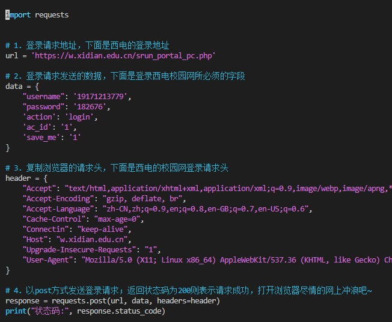

# Linux/Ubuntu下的PPPoE拨号上网方法

```
sudo pppoeconf
sudo pon dsl-provider
sudo poff
plog
```


# 如何使用
command 1.1和1.2 可远程连接ssh 2.1可远程进入虚拟桌面
## 1、连接网络
### 1.0 检测哪个网口插有网线
```
ethtool eno1
Link detected: yes
ethtool eno2
Link detected: no
```

### 1.1 给eth0网口分配临时的局域网ip地址(以往的经验：后面连网上后ip会变否则还是不能远程终端)

`sudo dhclient eth0 ` 

### 1.2 最下方查看源码,输出200即可上网

`python /media/ubuntu/net/xidian.py `



## 2、开启桌面
输入以下命令即可创建虚拟桌面,会默认分配ip序号：如果不写则从1开始每新建一个就会+1

` vncserver :1 or vncserver `

 如果需要多用户同时在线用以下命令，需要创建不同的用户

`su test  -c 'vncserver -geometry 2560x1440 :1'`


注意：windows端如遇到进不去的情况可以查看5900+ip序号端口是否开放的问题


# 如何安装和配置xfce+TightVNC以及如何美化fce

/user/share/backgrounds/xfce
/usr/share/xfce4/backdrops

[如何优雅的桌面远程Ubuntu](https://zhuanlan.zhihu.com/p/126265221)
## 0.Xfce安装
Xfce + TightVNC
Ubuntu自带屏幕分享
先来说说第一种方案的缺点，开启UbuntuXfce + TightVNC之后，自身的桌面服务无法启动，（一般来说，windows的远程桌面，被远程的机器也是无法操控桌面的。）所以这种方案适用于远程机器不使用桌面服务的场景。具体操作如下：

安装Xfce及TightVNC
```shell
sudo apt update
sudo apt install xfce4 xfce4-goodies
sudo apt install tightvncserver
```

启动vncserver并进行配置：

`vncserver`

```
Password:
Verify:

Would you like to enter a view-only password (y/n)? n
xauth:  file /home/yourname/.Xauthority does not exist

New 'X' desktop is your_hostname:1
```
vncpasswd

将刚才启动的vncserver终止，修改配置文件


```
vncserver -kill :1
mv ~/.vnc/xstartup ~/.vnc/xstartup.bak
vim ~/.vnc/xstartup
```

修改xstartup
如果连接不上试着 开放端口 5900+桌面号.

```bash
#!/bin/bash
xrdb $HOME/.Xresources
startxfce4 &
```

推出并保存，设置xstartup权限

`sudo chmod +x ~/.vnc/xstartup`
再次启动vncserver，可以配置对应屏幕分辨率：

```

vncserver -geometry 1920x1080

```
启动成功将输出：


```

 _New 'X' desktop is your_hostname:1

Starting applications specified in /home/yourname/.vnc/xstartup
Log file is /home/yourname/.vnc/your_hostname:1.log_ 

```


此时，重启Ubuntu系统，在另一台机器上下载VNC客户端进行连接：

ip输入：1.2.3.4:1

其他配置默认。


## 1.xfce安装谷歌浏览器

```
wget https://dl.google.com/linux/direct/google-chrome-stable_current_amd64.deb

sudo dpkg -i google-chrome-stable_current_amd64.deb
```

#若提示缺失包，先安装缺失包再运行该命令 
## 2.安装中文输入法
`sudo apt install ibus-libpinyin`
#安装完后可能需要重启一下电脑，另外需要自行打开ibus
#左上角点击application，点击settings，点击iBus Preferences

## 3.桌面美化
https://connectwww.com/how-to-install-macos-theme-on-your-linux-xfce-desktop/61588/

## 4.如果安装tim等软件会出现乱码，可以安装一下中文环境
sudo apt update && sudo apt install language-pack-zh-hans

修改配置文件：
`sudo vim /etc/default/locale`
#替换成如下内容

```
LANG="zh_CN.UTF-8"
LANGUAGE="zh_CN:zh"
LC_NUMERIC="zh_CN"
LC_TIME="zh_CN"
LC_MONETARY="zh_CN"
LC_PAPER="zh_CN"
LC_NAME="zh_CN"
LC_ADDRESS="zh_CN"
LC_TELEPHONE="zh_CN"
LC_MEASUREMENT="zh_CN"
LC_IDENTIFICATION="zh_CN"
LC_ALL="zh_CN.UTF-8"
```


修改环境文件:
vim /etc/environment
不修改原有内容！！！直接在原内容下面新开一行加入下列内容：
LANG="zh_CN.UTF-8"
LANGUAGE="zh_CN:zh"
LC_NUMERIC="zh_CN"
LC_TIME="zh_CN"
LC_MONETARY="zh_CN"
LC_PAPER="zh_CN"
LC_NAME="zh_CN"
LC_ADDRESS="zh_CN"
LC_TELEPHONE="zh_CN"
LC_MEASUREMENT="zh_CN"
LC_IDENTIFICATION="zh_CN"
LC_ALL="zh_CN.UTF-8"


## 5.不小心添加了三方源：

 在Ubuntu下软件源的文件是/etc/apt/sources.list，那么sourdces.list.d目录下的文件又是什么作用呢？
 该文件夹下的文件是第三方软件的源，可以分别存放不同的第三源地址，只需“扩展名”为list即可

所以可以去/etc/apt/sources.list.d目录下把不想保留的第三方源的文件给删除就行了

## 6.给WSL2终端和git配置代理


### 6.1.在 Windows主机内通过 Clash开启代理，并允许通过LAN连接

### 6.2 假设 Windows 上的 Clash 已允许 LAN 连接，监听在7890端口，
SOCKS5 代理监听在 1080端口:
[运行sudo vim ~/.bashrc添加以下内容到 ~/.bashrc]

#获取 Windows 主机 ip
export hostip=$(cat /etc/resolv.conf |grep -oP '(?<=nameserver\ ).*')
#配置终端代理
export https_proxy="http://${hostip}:7890
export http_proxy="http://${hostip}:7890"
export all_proxy="socks5://${hostip}:1080"


### 6.3 git代理配置

在终端运行
`cat /etc/resolv.conf |grep -oP '(?<=nameserver\ ).*'`
#获取 Windows 主机 ip

将下面内容中的${hostip}替换成输出结果(获取到的windows主机ip)
运行`sudo vim ~/.gitconfig`将替换后的内容添加到.gitconfig


#需要将${hostip}替换成获取到的windows主机ip

```
[https]
    proxy = http://${hostip}:7890
[http]
    proxy = http://${hostip}:7890

```


```
import requests


# 1. 登录请求地址，下面是西电的登录地址
url = 'https://w.xidian.edu.cn/srun_portal_pc.php'

# 2. 登录请求发送的数据，下面是登录西电校园网所必须的字段
data = {
    "username": '19171213779',
    "password": '182676',
    'action': 'login',
    'ac_id': '1',
    'save_me': '1'
}

# 3. 复制浏览器的请求头，下面是西电的校园网登录请求头
header = {
    "Accept": "text/html,application/xhtml+xml,application/xml;q=0.9,image/webp,image/apng,*/*;q=0.8,application/signed-exchange;v=b3;q=0.9",
    "Accept-Encoding": "gzip, deflate, br",
    "Accept-Language": "zh-CN,zh;q=0.9,en;q=0.8,en-GB;q=0.7,en-US;q=0.6",
    "Cache-Control": "max-age=0",
    "Connectin": "keep-alive",
    "Host": "w.xidian.edu.cn",
    "Upgrade-Insecure-Requests": "1",
    "User-Agent": "Mozilla/5.0 (X11; Linux x86_64) AppleWebKit/537.36 (KHTML, like Gecko) Chrome/87.0.4280.88 Safari/537.36",
}

# 4. 以post方式发送登录请求；返回状态码为200则表示请求成功，打开浏览器尽情的网上冲浪吧~
response = requests.post(url, data, headers=header)
print("状态码:", response.status_code)


[vnc4server多用户配置](https://www.jianshu.com/p/24ade8ca7672)

